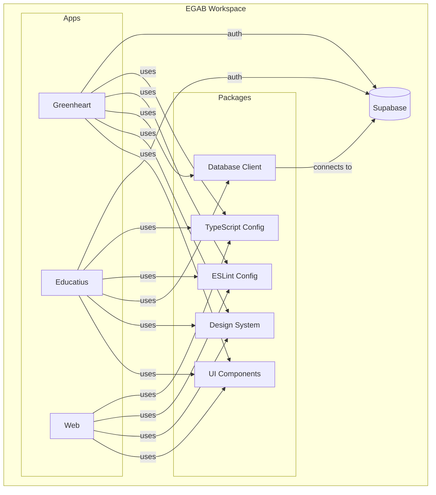
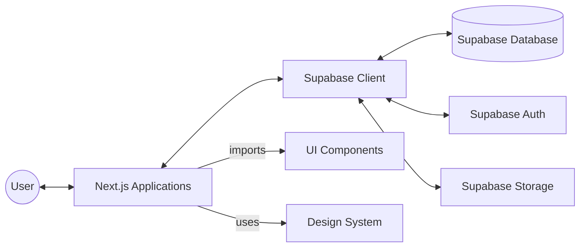
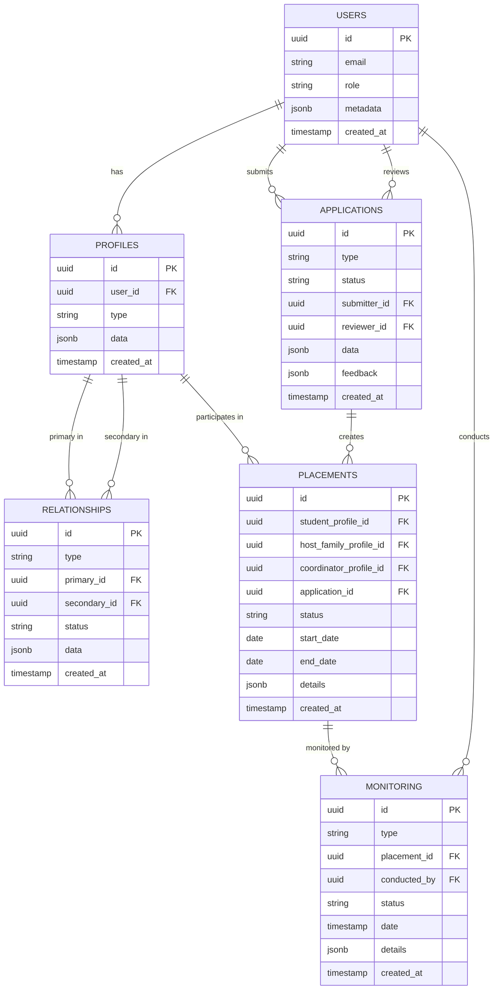

# EGAB Architecture

## System Overview

EGAB uses a monorepo architecture powered by Turborepo to manage multiple applications and shared packages. This approach enables code sharing, consistent development practices, and efficient build processes.

## Core Components

### Application Layer

The application layer consists of distinct Next.js applications:

1. **Greenheart**: Receiving Organization platform for handling local coordinators, host families, and student placements
2. **Educatius**: Sending Organization platform for managing student applications and program monitoring
3. **Web**: UI component showcase application

Each application:
- Maintains its own routing and pages
- Imports shared components from packages
- Can implement application-specific features
- Connects to Supabase for data persistence

### Shared Packages Layer

Shared packages provide reusable code across applications:

1. **UI**: Component library built with React and Tailwind CSS
   - Implements Shadcn/UI design patterns
   - Provides accessible, performance-optimized components

2. **Design System**: Consistent design tokens and styling
   - Color schemes
   - Typography
   - Spacing and layout rules

3. **Database**: Supabase client and utilities
   - Shared database client
   - Type definitions
   - Helper functions and hooks for data access
   - Authentication utilities

4. **Configuration Packages**:
   - ESLint configuration
   - TypeScript configuration

### Data Layer

Supabase provides a complete solution for:

1. **Database**: PostgreSQL database with domain-based tables:
   - Users (all user types across applications)
   - Profiles (coordinator, host family, student profiles)
   - Applications (coordinator, host family, student applications)
   - Relationships (connections between entities)
   - Placements (student-host family matches)
   - Monitoring (check-ins, visits, etc.)

2. **Authentication**: User management with:
   - Email/password authentication
   - Role-based access control
   - Session management

3. **Storage**: File storage for:
   - Application documents
   - Profile images
   - Supporting materials

## Data Flow Architecture

## Build and Deployment Architecture

Turborepo manages the build process with:
- Smart caching to avoid redundant builds
- Parallel task execution
- Dependency graph awareness

The build process generates optimized assets for each application, which can be deployed independently or as part of a coordinated release.

## Security Architecture

Note: As mentioned in the product requirements, EGAB is a sandboxing environment for prototypes, so comprehensive security protocols for authentication aren't required. However, basic practices are still followed:

- Strict typing with TypeScript
- Component-level input validation
- Secure API communication patterns
- Basic role-based access control through Supabase

## Database Schema Architecture

## Scalability Considerations

- Independent scaling of applications
- Shared UI components reduce maintenance overhead
- Consistent developer experience across teams
- Low-coupling design for team autonomy
- Supabase provides managed infrastructure that can scale with usage
- Application-agnostic database schema enables adding new applications without schema changes
