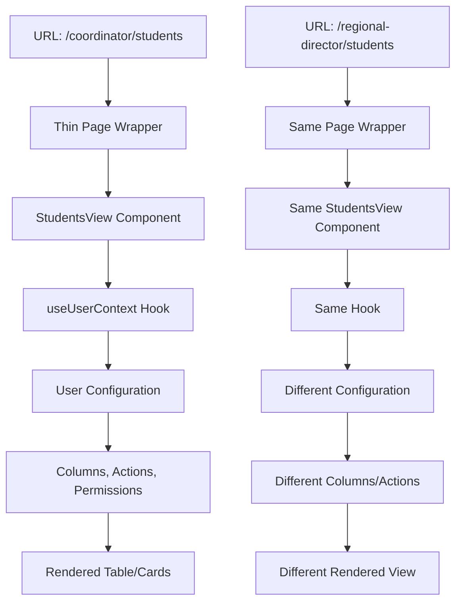

# User Type Configuration System Implementation Guide

## Overview

This document provides a detailed implementation plan for creating a scalable, maintainable user type configuration system that allows multiple user types to share the same view components while having different navigation, permissions, and display configurations.

## Current Architecture Analysis

### Strengths of Current Structure ✅

1. **Already User-Type Aware**: Current structure `app/(public)/[userType]/{page-name}` where `sevis-user` is a userType
2. **Flexible Navigation**: `PageLayout` component supports `navigationType` prop with multiple user types
3. **Shared Components**: Thin page wrappers with shared view components
4. **Configuration-Driven**: Navigation already uses `navigationItemsByType` in `LeftSidebar.tsx`

### Current Navigation Types
```typescript
// packages/ui/components/templates/LeftSidebar.tsx
export type NavigationType = 'student' | 'sevis' | 'host' | 'coordinator'

export const navigationItemsByType: Record<NavigationType, Array<{ href: string; label: string }>> = {
  student: [...],
  sevis: [...],
  host: [...],
  coordinator: [...]
}
```

### Problem Statement
Currently, adding a new user type requires:
- Duplicating page files for each user type
- Manual configuration in multiple places
- Potential for inconsistent behavior across user types
- Maintenance overhead for shared functionality

## Proposed Solution Architecture

### Core Concept: Configuration-Driven Views

Instead of duplicating pages, use **shared view components** that adapt their behavior based on **user type configuration**.



## Implementation Plan

### Phase 1: Core Infrastructure (2-3 hours)

#### 1.1 Create User Context System

**File: `lib/useUserContext.ts`**
```typescript
'use client'

import { usePathname } from 'next/navigation'
import { getUserConfig, getUserPermissions, getNavigationConfig } from './user-configs'

export interface UserContextType {
  userType: string
  config: UserConfig
  permissions: string[]
  navigation: NavigationConfig
}

export function useUserContext(): UserContextType {
  const pathname = usePathname()
  const userType = pathname.split('/')[1] || 'sevis-user'
  
  return {
    userType,
    config: getUserConfig(userType),
    permissions: getUserPermissions(userType),
    navigation: getNavigationConfig(userType)
  }
}

// Helper hook for just getting user type
export function useUserType(): string {
  const pathname = usePathname()
  return pathname.split('/')[1] || 'sevis-user'
}
```

#### 1.2 Create Configuration System

**File: `lib/user-configs.ts`**
```typescript
export interface UserConfig {
  displayName: string
  theme: string
  views: {
    students: StudentViewConfig
    hostFamilies: HostFamilyViewConfig
    placements: PlacementViewConfig
    // Add other views as needed
  }
}

export interface StudentViewConfig {
  columns: string[]
  actions: string[]
  filters: string[]
  permissions: string[]
  bulkActions: string[]
  defaultSort: { field: string; direction: 'asc' | 'desc' }
}

export interface HostFamilyViewConfig {
  columns: string[]
  actions: string[]
  filters: string[]
  permissions: string[]
  bulkActions: string[]
  defaultSort: { field: string; direction: 'asc' | 'desc' }
}

export interface PlacementViewConfig {
  columns: string[]
  actions: string[]
  filters: string[]
  permissions: string[]
  bulkActions: string[]
  defaultSort: { field: string; direction: 'asc' | 'desc' }
}

export interface NavigationConfig {
  items: Array<{ href: string; label: string; icon?: string }>
  headerType: 'greeting' | 'profile' | 'action' | 'yearSelector' | 'studentApplication'
  rightSidebar: {
    enabled: boolean
    defaultTab: string
    tabs: string[]
  }
}

// Configuration for each user type
export const userConfigs: Record<string, UserConfig> = {
  'sevis-user': {
    displayName: 'SEVIS User',
    theme: 'default',
    views: {
      students: {
        columns: ['name', 'country', 'grade', 'program', 'status', 'sevisStatus', 'actions'],
        actions: ['view-application', 'edit-application', 'approve', 'reject', 'view-sevis', 'bulk-assign'],
        filters: ['status', 'country', 'program', 'grade', 'sevisStatus'],
        permissions: ['canApprove', 'canViewSevis', 'canBulkEdit', 'canEditApplications'],
        bulkActions: ['bulk-approve', 'bulk-reject', 'bulk-assign-coordinator'],
        defaultSort: { field: 'name', direction: 'asc' }
      },
      hostFamilies: {
        columns: ['name', 'location', 'status', 'capacity', 'currentStudents', 'actions'],
        actions: ['view-profile', 'edit-profile', 'approve', 'assign-student', 'view-history'],
        filters: ['status', 'location', 'capacity', 'program'],
        permissions: ['canApprove', 'canAssignStudents', 'canViewHistory'],
        bulkActions: ['bulk-approve', 'bulk-assign-coordinator'],
        defaultSort: { field: 'name', direction: 'asc' }
      },
      placements: {
        columns: ['student', 'hostFamily', 'coordinator', 'status', 'startDate', 'endDate', 'actions'],
        actions: ['view-details', 'edit-placement', 'approve', 'reassign', 'end-placement'],
        filters: ['status', 'coordinator', 'region', 'program'],
        permissions: ['canApprove', 'canReassign', 'canEndPlacement'],
        bulkActions: ['bulk-approve', 'bulk-reassign'],
        defaultSort: { field: 'startDate', direction: 'desc' }
      }
    }
  },
  
  'coordinator': {
    displayName: 'Local Coordinator',
    theme: 'default',
    views: {
      students: {
        columns: ['name', 'country', 'grade', 'hostFamily', 'school', 'status', 'actions'],
        actions: ['view-profile', 'assign-host', 'schedule-visit', 'add-note', 'contact-student'],
        filters: ['status', 'school', 'hostFamily', 'grade'],
        permissions: ['canAssignHost', 'canScheduleVisit', 'canAddNote', 'canContact'],
        bulkActions: ['bulk-schedule-visit', 'bulk-notify'],
        defaultSort: { field: 'name', direction: 'asc' }
      },
      hostFamilies: {
        columns: ['name', 'location', 'currentStudents', 'capacity', 'lastContact', 'actions'],
        actions: ['view-profile', 'contact-family', 'schedule-visit', 'add-note', 'assign-student'],
        filters: ['location', 'capacity', 'availability', 'program'],
        permissions: ['canContact', 'canScheduleVisit', 'canAssignStudent'],
        bulkActions: ['bulk-contact', 'bulk-schedule-visit'],
        defaultSort: { field: 'location', direction: 'asc' }
      },
      placements: {
        columns: ['student', 'hostFamily', 'startDate', 'status', 'lastVisit', 'actions'],
        actions: ['view-details', 'schedule-visit', 'add-note', 'contact-parties'],
        filters: ['status', 'location', 'visitStatus'],
        permissions: ['canScheduleVisit', 'canAddNote', 'canContact'],
        bulkActions: ['bulk-schedule-visit', 'bulk-notify'],
        defaultSort: { field: 'startDate', direction: 'desc' }
      }
    }
  },

  'regional-director': {
    displayName: 'Regional Director',
    theme: 'default',
    views: {
      students: {
        columns: ['name', 'coordinator', 'region', 'status', 'program', 'actions'],
        actions: ['view-profile', 'reassign-coordinator', 'view-reports', 'bulk-actions'],
        filters: ['region', 'coordinator', 'status', 'program'],
        permissions: ['canReassign', 'canViewReports', 'canBulkAction', 'canManageCoordinators'],
        bulkActions: ['bulk-reassign', 'bulk-notify', 'bulk-export'],
        defaultSort: { field: 'region', direction: 'asc' }
      },
      hostFamilies: {
        columns: ['name', 'coordinator', 'region', 'status', 'capacity', 'actions'],
        actions: ['view-profile', 'reassign-coordinator', 'view-reports', 'approve'],
        filters: ['region', 'coordinator', 'status', 'capacity'],
        permissions: ['canReassign', 'canViewReports', 'canApprove'],
        bulkActions: ['bulk-reassign', 'bulk-approve'],
        defaultSort: { field: 'region', direction: 'asc' }
      },
      placements: {
        columns: ['student', 'hostFamily', 'coordinator', 'region', 'status', 'actions'],
        actions: ['view-details', 'reassign-coordinator', 'view-reports', 'approve'],
        filters: ['region', 'coordinator', 'status'],
        permissions: ['canReassign', 'canViewReports', 'canApprove'],
        bulkActions: ['bulk-reassign', 'bulk-approve'],
        defaultSort: { field: 'region', direction: 'asc' }
      }
    }
  },

  'host-family': {
    displayName: 'Host Family',
    theme: 'default',
    views: {
      students: {
        columns: ['name', 'country', 'grade', 'school', 'arrivalDate', 'actions'],
        actions: ['view-profile', 'message', 'view-schedule', 'report-issue'],
        filters: ['school', 'grade', 'program'],
        permissions: ['canViewProfile', 'canMessage', 'canViewSchedule', 'canReportIssue'],
        bulkActions: [], // Host families typically don't need bulk actions
        defaultSort: { field: 'arrivalDate', direction: 'desc' }
      },
      hostFamilies: {
        columns: [], // Host families don't see other host families
        actions: [],
        filters: [],
        permissions: [],
        bulkActions: [],
        defaultSort: { field: 'name', direction: 'asc' }
      },
      placements: {
        columns: ['student', 'startDate', 'endDate', 'status', 'coordinator', 'actions'],
        actions: ['view-details', 'contact-coordinator', 'view-schedule', 'report-issue'],
        filters: ['status', 'timeframe'],
        permissions: ['canViewDetails', 'canContactCoordinator', 'canViewSchedule', 'canReportIssue'],
        bulkActions: [],
        defaultSort: { field: 'startDate', direction: 'desc' }
      }
    }
  },

  'partner': {
    displayName: 'Partner Organization',
    theme: 'default',
    views: {
      students: {
        columns: ['name', 'country', 'program', 'status', 'coordinator', 'actions'],
        actions: ['view-profile', 'view-progress', 'contact-coordinator', 'generate-report'],
        filters: ['program', 'status', 'coordinator', 'region'],
        permissions: ['canViewProfile', 'canViewProgress', 'canContactCoordinator', 'canGenerateReport'],
        bulkActions: ['bulk-export', 'bulk-notify'],
        defaultSort: { field: 'name', direction: 'asc' }
      },
      hostFamilies: {
        columns: ['name', 'location', 'students', 'coordinator', 'actions'],
        actions: ['view-profile', 'contact-coordinator', 'view-reports'],
        filters: ['location', 'coordinator', 'program'],
        permissions: ['canViewProfile', 'canContactCoordinator', 'canViewReports'],
        bulkActions: ['bulk-export'],
        defaultSort: { field: 'location', direction: 'asc' }
      },
      placements: {
        columns: ['student', 'hostFamily', 'coordinator', 'status', 'program', 'actions'],
        actions: ['view-details', 'contact-coordinator', 'generate-report'],
        filters: ['program', 'status', 'coordinator', 'region'],
        permissions: ['canViewDetails', 'canContactCoordinator', 'canGenerateReport'],
        bulkActions: ['bulk-export'],
        defaultSort: { field: 'program', direction: 'asc' }
      }
    }
  }
}

// Helper functions
export function getUserConfig(userType: string): UserConfig {
  return userConfigs[userType] || userConfigs['sevis-user']
}

export function getUserPermissions(userType: string): string[] {
  const config = getUserConfig(userType)
  // Flatten all permissions from all views
  const allPermissions = new Set<string>()
  
  Object.values(config.views).forEach(view => {
    view.permissions.forEach(permission => allPermissions.add(permission))
  })
  
  return Array.from(allPermissions)
}

export function getNavigationConfig(userType: string): NavigationConfig {
  // This would integrate with the existing navigationItemsByType
  // For now, return a basic structure
  return {
    items: [],
    headerType: 'yearSelector',
    rightSidebar: {
      enabled: true,
      defaultTab: 'inbox',
      tabs: ['inbox', 'notifications']
    }
  }
}
```

#### 1.3 Create Permission System

**File: `lib/permissions.ts`**
```typescript
export interface Permission {
  id: string
  name: string
  description: string
  category: 'student' | 'hostFamily' | 'placement' | 'system'
}

export const permissions: Record<string, Permission> = {
  // Student permissions
  canViewProfile: {
    id: 'canViewProfile',
    name: 'View Profile',
    description: 'Can view detailed student profiles',
    category: 'student'
  },
  canEditApplications: {
    id: 'canEditApplications',
    name: 'Edit Applications',
    description: 'Can edit student applications',
    category: 'student'
  },
  canApprove: {
    id: 'canApprove',
    name: 'Approve',
    description: 'Can approve applications and placements',
    category: 'system'
  },
  canViewSevis: {
    id: 'canViewSevis',
    name: 'View SEVIS',
    description: 'Can view SEVIS-related information',
    category: 'student'
  },
  canBulkEdit: {
    id: 'canBulkEdit',
    name: 'Bulk Edit',
    description: 'Can perform bulk edit operations',
    category: 'system'
  },
  
  // Host Family permissions
  canAssignHost: {
    id: 'canAssignHost',
    name: 'Assign Host',
    description: 'Can assign students to host families',
    category: 'hostFamily'
  },
  canAssignStudents: {
    id: 'canAssignStudents',
    name: 'Assign Students',
    description: 'Can assign students to host families',
    category: 'hostFamily'
  },
  canViewHistory: {
    id: 'canViewHistory',
    name: 'View History',
    description: 'Can view placement history',
    category: 'hostFamily'
  },
  
  // Placement permissions
  canScheduleVisit: {
    id: 'canScheduleVisit',
    name: 'Schedule Visit',
    description: 'Can schedule home visits',
    category: 'placement'
  },
  canReassign: {
    id: 'canReassign',
    name: 'Reassign',
    description: 'Can reassign coordinators or placements',
    category: 'placement'
  },
  canEndPlacement: {
    id: 'canEndPlacement',
    name: 'End Placement',
    description: 'Can end student placements',
    category: 'placement'
  },
  
  // Communication permissions
  canContact: {
    id: 'canContact',
    name: 'Contact',
    description: 'Can contact students, families, coordinators',
    category: 'system'
  },
  canMessage: {
    id: 'canMessage',
    name: 'Message',
    description: 'Can send messages',
    category: 'system'
  },
  
  // Administrative permissions
  canViewReports: {
    id: 'canViewReports',
    name: 'View Reports',
    description: 'Can view detailed reports',
    category: 'system'
  },
  canBulkAction: {
    id: 'canBulkAction',
    name: 'Bulk Actions',
    description: 'Can perform bulk actions',
    category: 'system'
  },
  canManageCoordinators: {
    id: 'canManageCoordinators',
    name: 'Manage Coordinators',
    description: 'Can manage coordinator assignments',
    category: 'system'
  }
}

export function hasPermission(userPermissions: string[], requiredPermission: string): boolean {
  return userPermissions.includes(requiredPermission)
}

export function hasAnyPermission(userPermissions: string[], requiredPermissions: string[]): boolean {
  return requiredPermissions.some(permission => userPermissions.includes(permission))
}

export function hasAllPermissions(userPermissions: string[], requiredPermissions: string[]): boolean {
  return requiredPermissions.every(permission => userPermissions.includes(permission))
}
```

### Phase 2: Update Existing Views (3-4 hours)

#### 2.1 Update StudentsView Component

**File: `apps/greenheart/app/(public)/sevis-user/views/students.tsx`**

Add to the top of the file:
```typescript
import { useUserContext } from '@/lib/useUserContext'
import { hasPermission } from '@/lib/permissions'
```

Update the StudentsView component:
```typescript
export function StudentsView({}: StudentsViewProps = {}) {
  const { userType, config, permissions } = useUserContext()
  const studentConfig = config.views.students
  
  // Existing data fetching logic...
  const { users, profiles, relationships, error, usedFallback, usingServiceClient } = useInstantData();
  
  // Use configuration to determine what columns to show
  const visibleColumns = studentConfig.columns
  const availableActions = studentConfig.actions
  const availableFilters = studentConfig.filters
  const userPermissions = permissions
  
  // Filter data based on user type and permissions
  const filteredStudents = useMemo(() => {
    let filtered = students
    
    // Apply user-type specific filtering
    switch (userType) {
      case 'host-family':
        // Host families only see their own students
        filtered = students.filter(student => 
          // Add logic to filter by host family relationship
          true // Placeholder
        )
        break
      case 'coordinator':
        // Coordinators only see students in their region
        filtered = students.filter(student => 
          // Add logic to filter by coordinator relationship
          true // Placeholder
        )
        break
      // Add other user type filters
    }
    
    return filtered
  }, [students, userType])
  
  // Create columns based on configuration
  const tableColumns = useMemo(() => {
    const columns = []
    
    if (visibleColumns.includes('name')) {
      columns.push({
        id: 'name',
        header: 'Name',
        accessorKey: 'name',
        cell: ({ row }) => (
          <div className="flex items-center gap-3">
            <Avatar className="h-8 w-8">
              <AvatarFallback>{row.original.initials}</AvatarFallback>
            </Avatar>
            <span className="font-medium">{row.original.name}</span>
          </div>
        )
      })
    }
    
    if (visibleColumns.includes('country')) {
      columns.push({
        id: 'country',
        header: 'Country',
        accessorKey: 'country'
      })
    }
    
    if (visibleColumns.includes('status')) {
      columns.push({
        id: 'status',
        header: 'Status',
        accessorKey: 'status',
        cell: ({ row }) => (
          <Badge variant={row.original.status.color}>
            {row.original.status.text}
          </Badge>
        )
      })
    }
    
    if (visibleColumns.includes('sevisStatus') && hasPermission(userPermissions, 'canViewSevis')) {
      columns.push({
        id: 'sevisStatus',
        header: 'SEVIS Status',
        accessorKey: 'sevisStatus',
        cell: ({ row }) => (
          row.original.sevisStatus ? (
            <Badge variant={row.original.sevisStatus.color}>
              {row.original.sevisStatus.text}
            </Badge>
          ) : (
            <span className="text-gray-400">Not Available</span>
          )
        )
      })
    }
    
    if (visibleColumns.includes('hostFamily')) {
      columns.push({
        id: 'hostFamily',
        header: 'Host Family',
        accessorKey: 'hostFamilyName'
      })
    }
    
    if (visibleColumns.includes('coordinator')) {
      columns.push({
        id: 'coordinator',
        header: 'Coordinator',
        accessorKey: 'coordinatorName'
      })
    }
    
    if (visibleColumns.includes('actions')) {
      columns.push(
        createActionsColumn({
          items: availableActions.map(action => ({
            id: action,
            label: getActionLabel(action),
            icon: getActionIcon(action),
            onClick: (row) => handleAction(action, row),
            show: (row) => hasPermission(userPermissions, getActionPermission(action))
          }))
        })
      )
    }
    
    return columns
  }, [visibleColumns, availableActions, userPermissions])
  
  // Create action handlers based on user type
  const handleAction = (action: string, row: any) => {
    switch (action) {
      case 'view-application':
        // Handle view application
        break
      case 'edit-application':
        // Handle edit application
        break
      case 'approve':
        // Handle approve
        break
      case 'assign-host':
        // Handle assign host
        break
      case 'schedule-visit':
        // Handle schedule visit
        break
      case 'contact-student':
        // Handle contact student
        break
      // Add other actions
    }
  }
  
  // Helper functions
  const getActionLabel = (action: string): string => {
    const actionLabels = {
      'view-application': 'View Application',
      'edit-application': 'Edit Application',
      'approve': 'Approve',
      'reject': 'Reject',
      'assign-host': 'Assign Host',
      'schedule-visit': 'Schedule Visit',
      'contact-student': 'Contact',
      'view-sevis': 'View SEVIS',
      'message': 'Message',
      'view-profile': 'View Profile',
      'add-note': 'Add Note'
    }
    return actionLabels[action] || action
  }
  
  const getActionIcon = (action: string) => {
    const actionIcons = {
      'view-application': <FileText className="h-4 w-4" />,
      'edit-application': <FileEdit className="h-4 w-4" />,
      'approve': <CheckCircle className="h-4 w-4" />,
      'reject': <AlertTriangle className="h-4 w-4" />,
      'assign-host': <Home className="h-4 w-4" />,
      'schedule-visit': <Clock className="h-4 w-4" />,
      'contact-student': <Send className="h-4 w-4" />,
      'message': <Send className="h-4 w-4" />,
      'view-profile': <UserCircle className="h-4 w-4" />,
      'add-note': <FileEdit className="h-4 w-4" />
    }
    return actionIcons[action] || <FileText className="h-4 w-4" />
  }
  
  const getActionPermission = (action: string): string => {
    const actionPermissions = {
      'view-application': 'canViewProfile',
      'edit-application': 'canEditApplications',
      'approve': 'canApprove',
      'reject': 'canApprove',
      'assign-host': 'canAssignHost',
      'schedule-visit': 'canScheduleVisit',
      'contact-student': 'canContact',
      'view-sevis': 'canViewSevis',
      'message': 'canMessage',
      'view-profile': 'canViewProfile',
      'add-note': 'canAddNote'
    }
    return actionPermissions[action] || 'canViewProfile'
  }
  
  // Rest of existing component logic...
  // Use tableColumns instead of hardcoded columns
  // Use filteredStudents instead of students
  // Use availableFilters for filter options
  // Use studentConfig.bulkActions for bulk action options
}
```

#### 2.2 Update Host Families View

**File: `apps/greenheart/app/(public)/sevis-user/views/host-families.tsx`**

Apply similar pattern:
```typescript
export function HostFamiliesView({}: HostFamiliesViewProps = {}) {
  const { userType, config, permissions } = useUserContext()
  const hostFamilyConfig = config.views.hostFamilies
  
  // Apply same pattern as StudentsView
  const visibleColumns = hostFamilyConfig.columns
  const availableActions = hostFamilyConfig.actions
  const availableFilters = hostFamilyConfig.filters
  const userPermissions = permissions
  
  // Filter data based on user type
  const filteredHostFamilies = useMemo(() => {
    let filtered = hostFamilies
    
    switch (userType) {
      case 'host-family':
        // Host families see only their own profile
        filtered = hostFamilies.filter(family => 
          // Add logic to filter by current user
          true // Placeholder
        )
        break
      case 'coordinator':
        // Coordinators see families in their region
        filtered = hostFamilies.filter(family => 
          // Add logic to filter by coordinator relationship
          true // Placeholder
        )
        break
    }
    
    return filtered
  }, [hostFamilies, userType])
  
  // Create columns based on configuration
  // Create action handlers based on user type
  // Apply same patterns as StudentsView
}
```

### Phase 3: Add New User Types (1-2 hours per type)

#### 3.1 Create New Route Structure

For each new user type, create the route structure:

**Example: Adding Coordinator User Type**

```bash
# Create the directory structure
mkdir -p apps/greenheart/app/(public)/coordinator/students
mkdir -p apps/greenheart/app/(public)/coordinator/host-families
mkdir -p apps/greenheart/app/(public)/coordinator/placements
```

**File: `apps/greenheart/app/(public)/coordinator/students/page.tsx`**
```typescript
'use client'

import { Suspense } from 'react'
import { StudentsView } from '../../sevis-user/views/students' // Reuse existing view
import { SkeletonLoader } from '@repo/ui/components/ui/skeleton-loader'

export default function CoordinatorStudentsPage() {
  return (
    <Suspense fallback={<SkeletonLoader viewType="table" />}>
      <StudentsView />
    </Suspense>
  )
}
```

**File: `apps/greenheart/app/(public)/coordinator/host-families/page.tsx`**
```typescript
'use client'

import { Suspense } from 'react'
import { HostFamiliesView } from '../../sevis-user/views/host-families' // Reuse existing view
import { SkeletonLoader } from '@repo/ui/components/ui/skeleton-loader'

export default function CoordinatorHostFamiliesPage() {
  return (
    <Suspense fallback={<SkeletonLoader viewType="table" />}>
      <HostFamiliesView />
    </Suspense>
  )
}
```

**File: `apps/greenheart/app/(public)/coordinator/placements/page.tsx`**
```typescript
'use client'

import { Suspense } from 'react'
import { PlacementsView } from '../../sevis-user/views/placements' // Reuse existing view
import { SkeletonLoader } from '@repo/ui/components/ui/skeleton-loader'

export default function CoordinatorPlacementsPage() {
  return (
    <Suspense fallback={<SkeletonLoader viewType="table" />}>
      <PlacementsView />
    </Suspense>
  )
}
```

#### 3.2 Create Layout for New User Type

**File: `apps/greenheart/app/(public)/coordinator/layout.tsx`**
```typescript
'use client'

import { PageLayout } from "@repo/ui/components/templates/PageLayout"
import { useState } from "react"
import { usePathname, useRouter } from "next/navigation"
import { useUserContext } from "@/lib/useUserContext"
// ... other imports

export default function CoordinatorLayout({
  children,
}: {
  children: React.ReactNode
}) {
  const { userType, config } = useUserContext()
  const [isRightSidebarOpen, setIsRightSidebarOpen] = useState(true)
  const pathname = usePathname()
  const router = useRouter()
  
  // Get coordinator-specific configuration
  const coordinatorConfig = config.views
  
  return (
    <PageLayout
      headerType="yearSelector"
      headerProps={{
        title: getPageTitle(pathname),
        currentYear: "2025-2026",
        years: ["2023-2024", "2024-2025", "2025-2026"],
        onYearChange: (year) => {/* handle year change */},
        actionButtons: coordinatorConfig.students.bulkActions.map(action => ({
          id: action,
          label: getActionLabel(action),
          variant: "outline" as const,
          onClick: () => handleBulkAction(action)
        }))
      }}
      logo={
        <div className="h-[50px] flex items-center justify-center">
          
        </div>
      }
      navigationType="coordinator"
      activeRoute={pathname || '/coordinator'}
      headerUserArea={
        // Same user area as existing layouts
        <div className="flex items-center gap-4 w-full">
          <div 
            className="flex w-[3.125rem] h-[3.125rem] items-start gap-[0.625rem] flex-shrink-0 rounded-[0.5rem] border border-white shadow-[0px_1px_3px_0px_rgba(16,24,40,0.10),0px_1px_2px_0px_rgba(16,24,40,0.06)] overflow-hidden"
          >
            
          </div>
          
          <div className="flex-1">
            <span className="font-medium text-gray-700">Local Coordinator</span>
          </div>
          
          {/* Dropdown menu similar to existing layouts */}
        </div>
      }
      isRightSidebarOpen={isRightSidebarOpen}
      onRightSidebarToggle={() => setIsRightSidebarOpen(!isRightSidebarOpen)}
      rightSidebarContent={
        // Coordinator-specific sidebar content
        <div className="h-full flex flex-col">
          {/* Coordinator-specific sidebar */}
        </div>
      }
    >
      {children}
    </PageLayout>
  )
}
```

#### 3.3 Update Navigation Configuration

**File: `packages/ui/components/templates/LeftSidebar.tsx`**

Update the navigation items:
```typescript
export const navigationItemsByType: Record<NavigationType, Array<{ href: string; label: string }>> = {
  student: [
    { href: '/', label: 'Home' },
    { href: '/application', label: 'Application' },
    { href: '/resources', label: 'Resources' },
  ],
  sevis: [
    { href: '/sevis-user', label: 'Home' },
    { href: '/sevis-user/students', label: 'Students' },
    { href: '/sevis-user/host-families', label: 'Host Families' },
    { href: '/sevis-user/local-coordinators', label: 'Local Coordinators' },
    { href: '/sevis-user/placements', label: 'Placements' },
    { href: '/sevis-user/change-queue', label: 'Change Queue' },
    { href: '/sevis-user/sevis', label: 'SEVIS' },
  ],
  host: [
    { href: '/host-family', label: 'Home' },
    { href: '/host-family/students', label: 'My Students' },
    { href: '/host-family/resources', label: 'Resources' },
  ],
  coordinator: [
    { href: '/coordinator', label: 'Home' },
    { href: '/coordinator/students', label: 'Students' },
    { href: '/coordinator/host-families', label: 'Host Families' },
    { href: '/coordinator/placements', label: 'Placements' },
    { href: '/coordinator/reports', label: 'Reports' },
  ],
  // Add other user types as needed
}
```

### Phase 4: Replicate in Juno App (1-2 hours)

#### 4.1 Copy Structure to Juno

The same structure can be replicated in the Juno app:

```bash
# Copy the route structure
cp -r apps/greenheart/app/(public)/coordinator apps/juno/app/(public)/coordinator
cp -r apps/greenheart/lib/useUserContext.ts apps/juno/lib/useUserContext.ts
cp -r apps/greenheart/lib/user-configs.ts apps/juno/lib/user-configs.ts
cp -r apps/greenheart/lib/permissions.ts apps/juno/lib/permissions.ts
```

#### 4.2 Customize for Juno Theme

**File: `apps/juno/lib/user-configs.ts`**

Update the theme and any Juno-specific configurations:
```typescript
export const userConfigs: Record<string, UserConfig> = {
  'coordinator': {
    displayName: 'Local Coordinator',
    theme: 'juno', // Juno-specific theme
    views: {
      students: {
        // Same configuration as Greenheart
        columns: ['name', 'country', 'grade', 'hostFamily', 'school', 'status', 'actions'],
        // ... rest of configuration
      }
    }
  }
  // ... other user types
}
```

### Phase 5: Testing and Validation (2-3 hours)

#### 5.1 Test Scenarios

1. **Navigation Testing**
   - Test that each user type sees correct navigation items
   - Test that URLs work correctly for each user type
   - Test that active states work properly

2. **Permission Testing**
   - Test that each user type sees only permitted columns
   - Test that each user type sees only permitted actions
   - Test that bulk actions are filtered correctly

3. **Data Filtering Testing**
   - Test that each user type sees appropriate data
   - Test that sensitive data is hidden from unauthorized users
   - Test that relationships are respected (coordinators see their students, etc.)

4. **Cross-App Testing**
   - Test that both Greenheart and Juno work correctly
   - Test that theme differences are applied
   - Test that shared components work in both apps

#### 5.2 Test Implementation

**File: `lib/test-user-configs.ts`**
```typescript
import { getUserConfig, getUserPermissions } from './user-configs'

// Test function to validate configurations
export function testUserConfigurations() {
  const userTypes = ['sevis-user', 'coordinator', 'regional-director', 'host-family', 'partner']
  
  userTypes.forEach(userType => {
    const config = getUserConfig(userType)
    const permissions = getUserPermissions(userType)
    
    console.log(`Testing ${userType}:`)
    console.log(`  - Display Name: ${config.displayName}`)
    console.log(`  - Student View Columns: ${config.views.students.columns.join(', ')}`)
    console.log(`  - Student View Actions: ${config.views.students.actions.join(', ')}`)
    console.log(`  - Permissions: ${permissions.join(', ')}`)
    console.log('')
  })
}
```

## Migration Strategy

### Minimal Risk Approach

1. **Keep Existing Structure** - Current `sevis-user` routes continue to work
2. **Add New User Types Gradually** - Add one user type at a time
3. **Test Thoroughly** - Each user type should be tested before adding the next
4. **Backward Compatibility** - Ensure existing functionality continues to work

### Rollout Plan

1. **Week 1**: Implement core infrastructure (useUserContext, user-configs, permissions)
2. **Week 2**: Update existing views to use configuration
3. **Week 3**: Add first new user type (coordinator)
4. **Week 4**: Add second new user type (regional-director)
5. **Week 5**: Add remaining user types and polish

### Rollback Strategy

If issues arise, the system can be rolled back by:
1. Reverting view components to their original state
2. Removing the new user type routes
3. Keeping the existing `sevis-user` structure intact

## Benefits of This Implementation

### ✅ Scalability
- **Easy to add new user types** - Just add configuration
- **Shared codebase** - No duplication of logic
- **Consistent behavior** - All user types use same underlying components

### ✅ Maintainability
- **Single source of truth** - View logic in one place
- **Configuration-driven** - Easy to modify behavior
- **Type-safe** - TypeScript ensures consistency

### ✅ User Experience
- **Tailored interfaces** - Each user type sees relevant information
- **Appropriate permissions** - Users can only perform allowed actions
- **Consistent navigation** - Familiar patterns across user types

### ✅ Development Efficiency
- **Faster feature development** - New features work for all user types
- **Easier testing** - Test once, works everywhere
- **Better code reuse** - Between Greenheart and Juno apps

## Considerations and Limitations

### 🤔 Complexity Considerations
- **Configuration complexity** - Large configuration objects can be hard to manage
- **Permission complexity** - Complex permission logic can be hard to debug
- **Testing complexity** - More user types = more test scenarios

### 🤔 Performance Considerations
- **Bundle size** - More configuration = larger bundles
- **Runtime performance** - Permission checks add overhead
- **Memory usage** - Configuration objects use memory

### 🤔 Maintenance Considerations
- **Configuration drift** - Configurations can become inconsistent
- **Permission creep** - Permissions can multiply over time
- **Testing overhead** - More user types = more testing required

## Conclusion

This implementation provides a scalable, maintainable solution for supporting multiple user types while avoiding code duplication. The configuration-driven approach ensures that:

1. **New user types can be added quickly** with minimal code changes
2. **Existing functionality remains stable** and backward compatible
3. **Both Greenheart and Juno can share the same logic** with only theme differences
4. **The system scales well** for production use

The total implementation time is estimated at **6-10 hours** with the majority of time spent on configuration and testing rather than complex code changes.

The key to success is starting with a solid foundation (which you already have) and building incrementally, testing each user type thoroughly before adding the next one. 